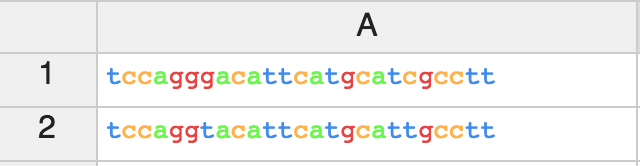
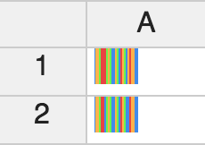
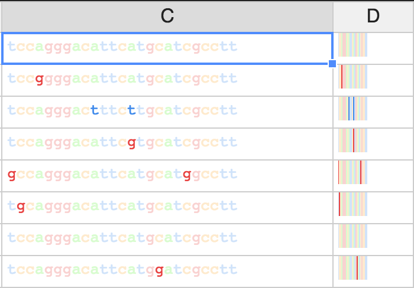

# Locus A-C-G-T

## Introduction

Locus A-C-G-T is a spreadsheet with special accommodations for DNA sequences.  It offers sequence-specific display formats and functions.

## Features

### Sequence-specific Formats

Sequences can be viewed as character strings.  When they are viewed in this way, they are color-coded using standard colors (the `A-C-G-T` in the header serves as a key).

Sequences may also be viewed as simple one-pixel wide vertical bars for a much denser display, using the same color coding.  Just select the cells you want displayed as stripes and choose _Toggle Stripes_ from the context menu.

### Reference Sequence

In either mode, you can assign one cell as a reference.  For bases where the displayed sequence matches the reference, the character or vertical bar will be light and for bases where it does not match, it will be dark; in this way mutations stand out clearly.  The shading is ambiguity-code aware.

### Sequence Tags _(coming soon)_

You can create a list of color-coded sequence tags, to identify interesting subsequences.  Wherever these sequences are found within any sequence on the spreadsheet, the characters (as letters or vertical bars) are overlaid with the tag color.

### Sequence-specific Functions

* #### *AMPLICON*(sequence, start, end) → sequence

   The bases from sequence, between start and end.

   `=AMPLICON("aacgtga", "ac", "tg") → "acgtg"`

* #### *BASE*(sequence, position) → base

   The base at that position.

   `=BASE("acgt", 3) → "g"`

* #### *COMPLEMENT*(sequence) → sequence

   The complement of the sequence.

   `=COMPLEMENT("aacgtata") → "ttgcatat"`

* #### *CONSENSUS*(range) → sequence

   Ambiguity-coded consensus sequence.

* #### *COUNT*(sequence, subsequence) → integer

   Number of times ambiguity-coded subsequence occurs within sequence.

   `=COUNT("acgaacgtacgacg", "acg") → 4`

   `=COUNT("acgaacgtacgacg", "a") → 5`

* #### *FIND*(sequence, subsequence) → integer

   Zero-based first position of ambiguity-coded subsequence within sequence.

   `=FIND("acg", "acgaacgtacgacg") → 0`

* #### *FIRST_DIFFERENCE*(range) → integer

   First position of disagreement among several sequences.

* #### *GC_CONTENT*(sequence) → integer

   The percent of G & C bases in the sequence.

   `=GC_CONTENT("accga") → 60`

* #### *LENGTH*(sequence) → integer

   The number of bases in the sequence.

   `=LENGTH("accga") → 5`

* #### *MELTING_TEMPERATURE*(sequence) → integer

   The melting temperature, in degrees Centigrade.

   `=MELTING_TEMPERATURE("aactatacgcagttc") → 36`

* #### *RANDOM_SEQUENCE*(length) → sequence

   A random sequence of the specified length.

* #### *REVERSE*(sequence) → sequence

   The reverse of the sequence.

   `=REVERSE("aacgtata") → "atatgcaa"`

* #### *REVERSE_COMPLEMENT*(sequence) → sequence

   The reverse complement of the sequence.

   `=REVERSE_COMPLEMENT("aacgtata") → "tatacgtt"`

## Technology

Locus A-C-G-T is built with [handsontable](https://handsontable.com/) and [Create React App](https://github.com/facebookincubator/create-react-app).

## Author

[Carl Manaster](<mailto:manaster@pobox.com>)

[github](https://github.com/carlmanaster)

[issues](https://github.com/carlmanaster/locus-acgt/projects/1)

[Try it here](https://carlmanaster.github.io/locus-acgt/)
